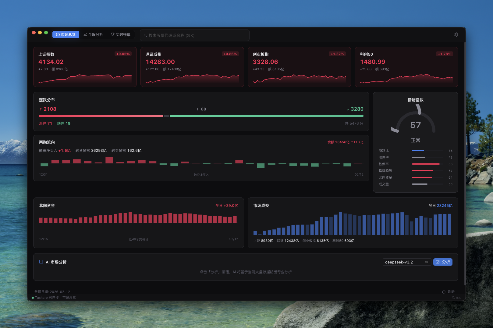
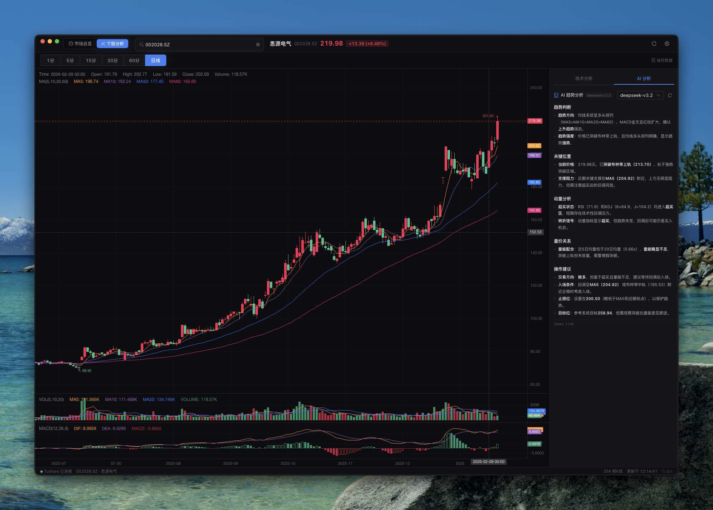

# 钱来终端 Money Come Terminal

> 为交易而生的 A 股量化看盘终端, A 股的 TradingView

一款基于 Electron + React + TypeScript 构建的桌面量化看盘软件，使用 Tushare 的高质量 A 股数据，集市场总览、资金流向监控、个股技术分析、AI 智能研判于一体，帮助交易者快速把握市场脉搏。

## 功能一览

### 市场总览



- **四大指数实时行情** — 上证指数、深证成指、创业板指、科创50，配备迷你走势图
- **涨跌分布** — 全市场涨跌家数、涨跌停统计，一眼看清多空格局
- **北向资金** — 30 日北向资金净流入柱状图，追踪外资动向
- **两融数据** — 融资融券余额、融资净买入趋势，观察杠杆资金方向
- **成交量** — 主要指数成交量与价格走势对比
- **情绪指数** — 综合涨跌比、涨跌停、指数趋势、北向资金、量能等 6 维度计算的 0-100 情绪仪表盘（冰点 → 沸点）

### 个股分析


- **专业 K 线图** — 基于 KLineCharts，支持 1 分 / 5 分 / 15 分 / 30 分 / 60 分 / 日线 六档周期切换
- **MA / MACD / KDJ / RSI / BOLL** — 自动计算主流技术指标
- **OBV / VWAP / ATR** — 量价分析与波动率指标
- **支撑阻力位** — 自动识别关键价格位
- **综合信号评分** — 趋势 / 震荡 / 量能 / 支撑阻力四维打分，给出强买到强卖的量化信号
- **智能交易计划** — 基于 ATR 自动生成入场价、止损位、目标位、仓位建议

### AI 分析



- **市场 AI 研判** — 将全市场数据（指数、涨跌分布、北向资金、两融、情绪指数）发送 AI 进行多空研判
- **个股 AI 分析** — 将个股全套技术指标数据发送 AI 进行趋势分析
- **多模型切换** — 支持配置多个模型，分析时通过下拉菜单自由切换
- **OpenAI 兼容接口** — 支持任何 OpenAI 格式的 API

## 技术栈

| 层级 | 技术                        |
| ---- | --------------------------- |
| 框架 | Electron 28 + electron-vite |
| 前端 | React 18 + TypeScript 5     |
| UI   | Ant Design 5 (暗色主题)     |
| 图表 | KLineCharts 9               |
| 数据 | Tushare Pro API             |
| AI   | OpenAI 兼容 API             |
| 构建 | Vite + electron-vite        |

## 快速开始

### 前置要求

- Node.js >= 18
- [Tushare Pro](https://tushare.pro) Token（日线数据需 2000+ 积分）

### 安装

```bash
git clone https://github.com/your-username/money-come-terminal.git
cd money-come-terminal
npm install
```

### 开发

```bash
npm run dev
```

### 构建

```bash
npm run build
```

### 配置

启动后点击右上角 ⚙️ 设置按钮：

1. **Tushare Token** — 填入你的 Tushare Pro Token，用于获取行情数据 (目前日线级别需要 2000 积分，可以通过捐助 Tushare 200 元获取； 分钟级行情需要单独开通，具体查看 [Tushare 官网](https://tushare.pro/weborder/#/permission/buy))
2. **AI API Key** — 填入 API Key，启用 AI 分析功能 (Powered by [阿 Q API](https://api.drqyq.com), 支持国内外主流模型)
3. **模型配置** — 填入模型名称，多个模型用逗号分隔（如 `deepseek-v3.2,gemini-3-pro-preview`）

## 快捷键

| 快捷键    | 功能          |
| --------- | ------------- |
| `⌘ + K`   | 聚焦搜索框    |
| `⌘ + R`   | 刷新数据      |
| `1` - `6` | 切换 K 线周期 |

## 项目结构

```
src/
├── main/                  # Electron 主进程
│   ├── ai/                # AI 客户端
│   ├── ipc/               # IPC 通信处理
│   ├── market/            # 市场数据聚合
│   ├── tushare/           # Tushare API 客户端
│   └── store.ts           # 配置持久化
├── preload/               # 预加载脚本
├── renderer/              # 渲染进程（React）
│   ├── analysis/          # 技术分析引擎
│   │   ├── indicators.ts  # MA/MACD/KDJ/RSI/BOLL
│   │   ├── signalEngine.ts # 综合信号评分
│   │   ├── sentimentEngine.ts # 情绪指数计算
│   │   ├── volume.ts      # OBV/VWAP
│   │   ├── atr.ts         # ATR/仓位管理
│   │   └── supportResistance.ts # 支撑阻力
│   ├── components/        # UI 组件
│   │   ├── market/        # 市场总览组件
│   │   ├── KLineView.tsx  # K 线图
│   │   ├── SignalDashboard.tsx # 信号面板
│   │   └── TradePlan.tsx  # 交易计划
│   └── hooks/             # 数据 Hooks
└── shared/                # 共享类型定义
```

## Roadmap

### v1.0 — 基础看盘与技术分析 ✅

- [x] Electron + React + TypeScript 项目搭建
- [x] Tushare Pro 数据接入（日线 / 分钟线）
- [x] 专业 K 线图（KLineCharts）、多周期切换
- [x] 技术指标引擎（MA / MACD / KDJ / RSI / BOLL / OBV / VWAP / ATR）
- [x] 综合信号评分系统（趋势 + 震荡 + 量能 + 支撑阻力）
- [x] 支撑阻力位自动识别
- [x] 基于 ATR 的智能交易计划（入场 / 止损 / 目标 / 仓位）
- [x] 暗色主题 UI、骨架屏加载、错误处理

### v1.1 — 市场总览仪表盘 ✅

- [x] 四大指数行情卡片 + 迷你走势图
- [x] 全市场涨跌分布（涨跌家数、涨跌停统计）
- [x] 北向资金 30 日净流入柱状图
- [x] 两融数据（融资融券余额、融资净买入趋势）
- [x] 成交量与指数价格走势
- [x] 六维度情绪指数仪表盘（冰点 → 沸点）
- [x] 主进程数据缓存与请求去重

### v1.2 — AI 智能分析 ✅

- [x] AI 市场研判（多空方向、板块推荐、仓位建议）
- [x] AI 个股趋势分析（纯技术面）
- [x] 多模型配置与下拉切换
- [x] OpenAI 兼容 API、用户自配 Key
- [x] 增强 Markdown 渲染器（代码块 / 斜体 / 嵌套列表）

### v2.0 — 龙头战法打板系统 🚧

> 专注短线打板，捕捉龙头妖股

- [ ] **涨停板复盘**
  - 每日涨停股自动归类（首板 / 二板 / 三板 / 高位板）
  - 涨停时间线排序（早板 > 午板 > 尾板）
  - 封单金额 / 开板次数 / 换手率统计
  - 炸板股追踪与分析

- [ ] **连板梯队监控**
  - 实时连板梯队展示（最高板 → 首板，梯形结构）
  - 连板股趋势图（连板天数 vs 涨幅曲线）
  - 断板预警（高位股跌停 / 大幅低开）
  - 历史连板高度统计（市场连板天花板）

- [ ] **题材热点追踪**
  - 涨停股按概念 / 行业自动聚类
  - 题材强度排名（涨停家数、封单总额、连板数）
  - 题材生命周期判断（发酵期 → 高潮期 → 退潮期）
  - 龙头股 / 跟风股 / 补涨股识别

- [ ] **龙头识别引擎**
  - 多维度龙头评分（板块地位、辨识度、资金、市场高度）
  - 龙头股 K 线与板块联动分析
  - 卡位 / 换手 / 一字板类型标注
  - 龙头晋级路径可视化（首板 → 妖股）

- [ ] **情绪周期模型**
  - 冰点 → 修复 → 发酵 → 高潮 → 退潮 五阶段判定
  - 基于连板高度、涨停家数、炸板率的周期转换信号
  - 各阶段最优策略提示（冰点低吸 / 高潮打板 / 退潮空仓）

- [ ] **打板辅助决策**
  - 封单强度评估（大单封板 / 散户封板）
  - 分时图量价形态分析（烂板 / 秒板 / T 字板）
  - 竞价异动监控（高开幅度、集合竞价量比）
  - AI 龙头战法分析（融合连板数据 + 题材热度 + 情绪周期）

### v2.1 — 盘中实时监控 📋

- [ ] 盘中涨停 / 跌停实时推送
- [ ] 异动股监控（急拉 / 急跌 / 放量突破）
- [ ] 自选股看板与预警
- [ ] 分时图实时刷新

### v3.0 — 回测与策略 📋

- [ ] 历史数据回测引擎
- [ ] 龙头战法策略回测（首板买入 / 二板确认 / 龙头接力）
- [ ] 策略绩效统计（胜率 / 盈亏比 / 最大回撤）
- [ ] 自定义策略编辑器

---

> ✅ 已完成 &nbsp; 🚧 开发中 &nbsp; 📋 规划中

## 声明

本软件仅供学习研究使用，不构成任何投资建议。股市有风险，投资需谨慎。

## License

MIT
